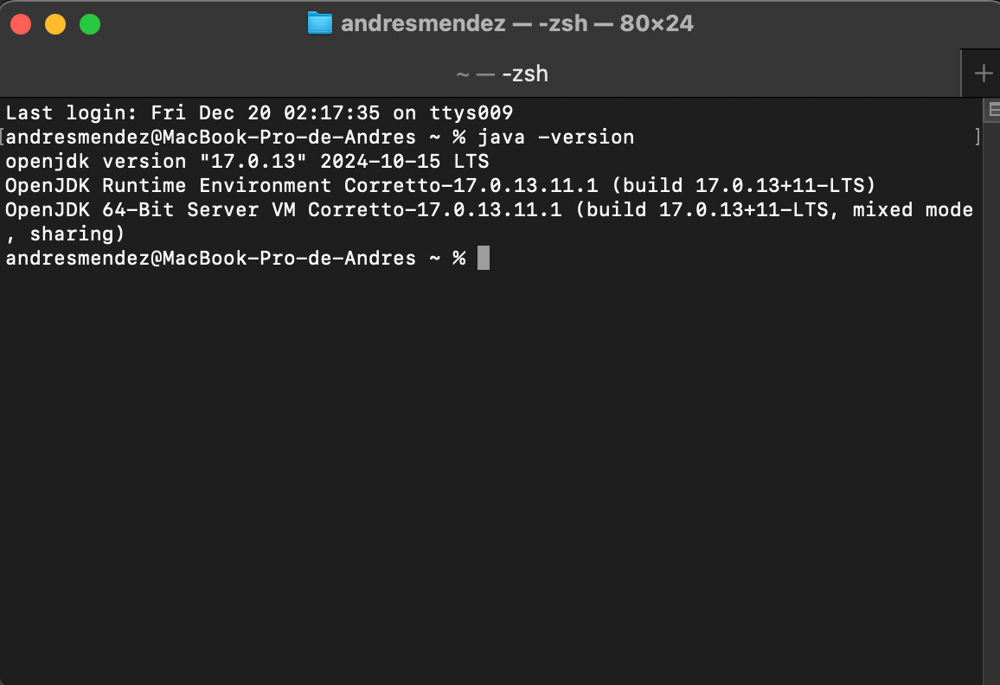
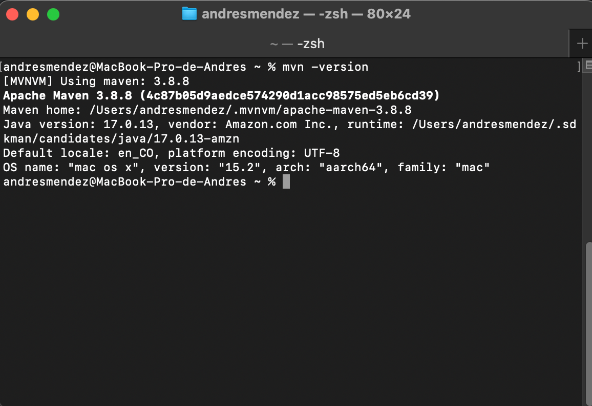
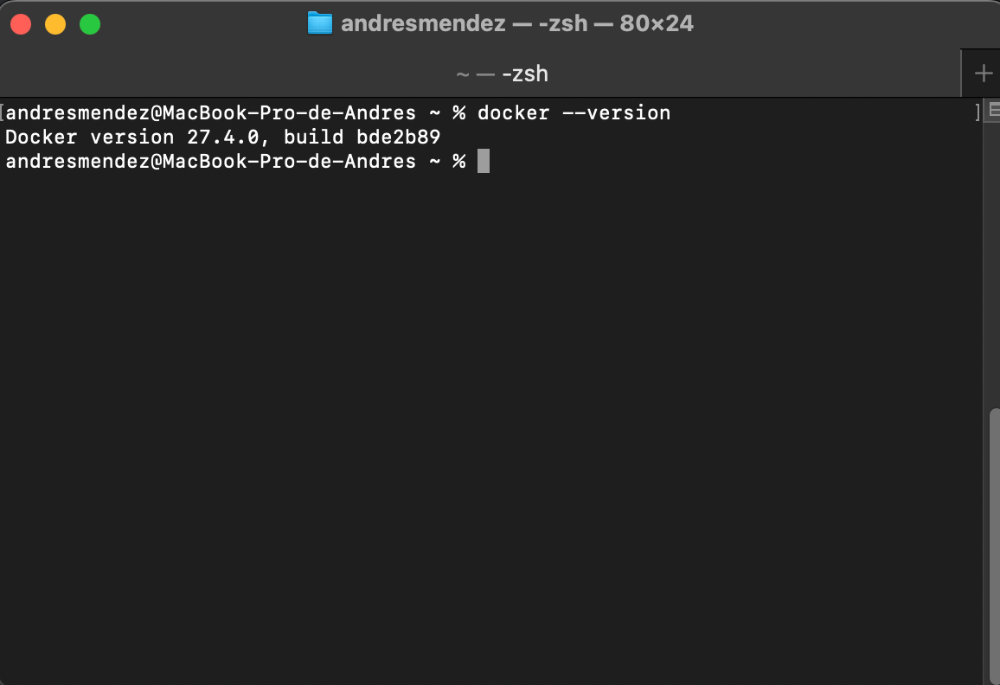

# seek-challenge
Project challenge seek

## Comenzando  🏁

_Proyecto CRUD de candidatos_

### Prerrequisitos 📋

* _Crear una cuenta de GitHub (opcional) -> [Registrar cuenta](https://github.com/join)_
* _Crear cuenta en Docker Hub (opcional) -> [Registrar cuenta](https://www.docker.com/products/docker-hub/)_
* _Docker -> [Descargar Docker](https://www.docker.com/products/docker-desktop/)_
* _JDK 17 -> [Descargar JDK 17](https://docs.aws.amazon.com/corretto/latest/corretto-17-ug/downloads-list.html)_
* _Maven -> [Descargar Maven](https://maven.apache.org/download.cgi)_
* _Flyway -> [Ver Documentación](https://unpocodejava.com/2018/01/02/que-es-flyway/)_
* _Junit_
* _Mockito_
* _OpenApi - Swagger_
* _Mysql_
* _Intellij_

## Instalación y configuración 🔧

### Java

_**1**. Para la primera instancia necesitaremos confirmar que la versión de JDK este correctamente instalada._

```
java -version
```



### Maven

_**2**. Validar versión de maven._

```
mvn -version
```




### Docker

_**3**. Validar versión de docker._

```
docker --version
```




## Compilación y despliegue ⚙️ 🚀

Ubicarse en la carpeta del proyecto

```
/seek-challenge
```

Compilación de proyecto en Java

```
mvn clean install -DskipTests -Dflyway.skip=true
```

Construcción de imagen a nivel de docker

```
docker compose build
```

Despliegue de proyecto

```
docker compose up
```

## Documentación Swagger 📚

* _Swagger Ui -> [Ver](http://vps-4592450-x.dattaweb.com:8080/seek/challenge/swagger-ui/index.html#/)_


